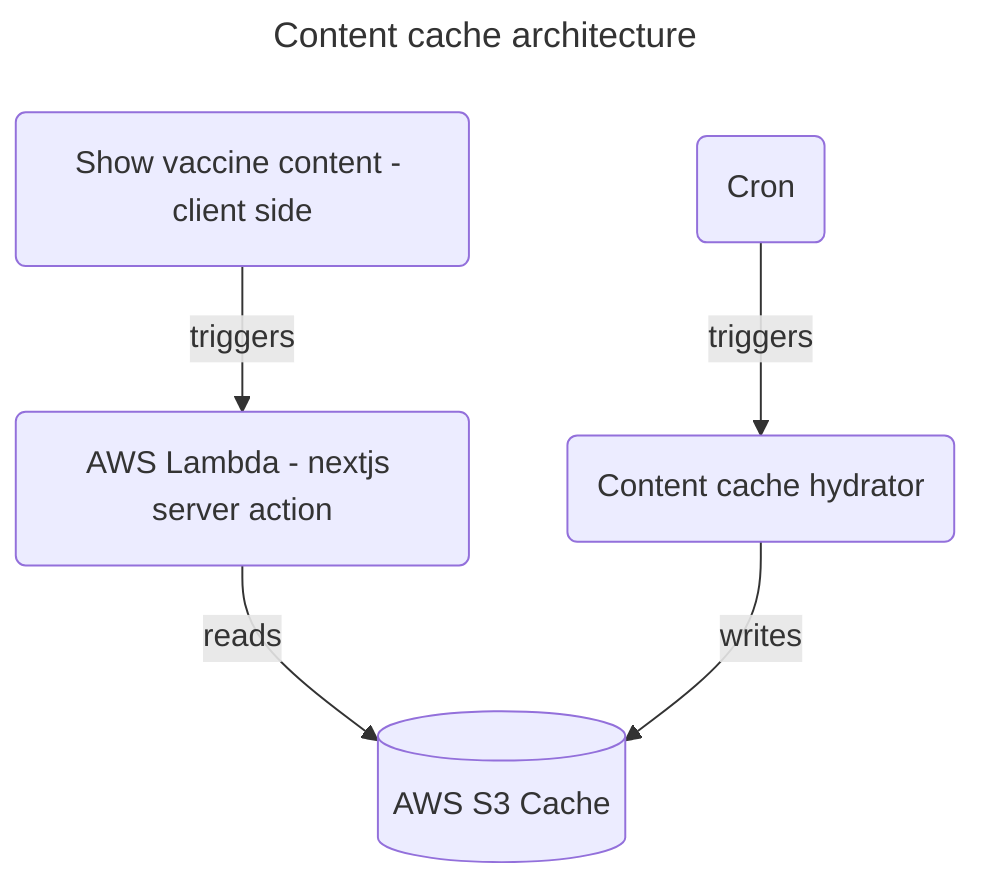

# ADR-004: Content caching architecture

>|              |                                                        |
>| ------------ |--------------------------------------------------------|
>| Date         | `22/04/2025`                                           |
>| Status       | `Accepted`                                             |
>| Deciders     | `Engineering, Architecture, `                          |
>| Significance | `Structure, Nonfunctional characteristics, Interfaces` |
>| Owners       | Ankur Jain, Elena Oanea                                |

---

- [ADR-004: Content caching architecture](#adr-004-content-caching-architecture)
  - [Context](#context)
  - [Decision](#decision)
    - [Assumptions](#assumptions)
    - [Drivers](#drivers)
    - [Options](#options)
    - [Outcome](#outcome)
    - [Rationale](#rationale)
  - [Consequences](#consequences)
  - [Compliance](#compliance)
  - [Notes](#notes)
  - [Actions](#actions)
  - [Tags](#tags)

## Context
According to the NHS.UK website content API guidelines for caching, we require a minimum of 7 days before calling the
endpoint again to fetch updated content. This requires us to keep a cache in place. There are two problems to design for.
Firstly, how do we keep the cache updated - meaning cache inserts, updates and deletes. Secondly, how and when does the
app read/write from/to cache that is the latest content.

## Decision
We decided to keep the design simple for maintainability purposes by separating the reading and writing to two separate
and independent processes. The writing part ensures to keep the cache updated as per the caching guidelines. The reading
part just reads from the cache assuming it is the correct and most up-to-date. This architecture is optimised for write
few and read many operations, which is our use case.

To ensure that the cache has the most up-to-date data for all vaccines, we have three mechanisms: -
1. a post deployment trigger that updates the cache each time a change is made to the writer or vaccines list.
2. a periodic cron job that updates the cache at a predefined frequency.
3. on demand trigger that allows updating when requested by nhs.uk.

### Assumptions
- The data itself is not updated very frequently because if it did, then the reads could suffer latency due to locking for updates.
- When we roll out the VitA app for the first time, there is a flag in NHS app that needs to be turned on for us to go live.
  This gives sufficient time for the cache writer to have pulled in all vaccine content.
- When we roll out new vaccines, there is a slight delay (seconds) between deployment finish and cache writer trigger.
  During this time, if a user visits the new vaccine page, they will see an error page. This should go away as soon as
  the new content is available.

### Drivers
Mostly simplifying the read process, so that it does not get mixed with writing logic.

### Options
Alternative design was to fetch the content on a cache miss and update the cache. After which, the subsequent reads
would succeed. This makes the read complex, and we really wanted to make read simple as that is going to be frequent.

### Outcome
The decision is reversible, if it turns out that people are seeing error pages frequently. This would be monitored.

### Rationale
Design that optimises for multiple reads and very infrequent writes.
Design that is simple to debug and separating the concerns makes it easier.

## Consequences
As outlined above in assumptions, there might be intermittent error pages shown when the vaccine content is being pulled.

## Compliance
The errors would be monitored so that service level objectives are met.

## Notes
None

## Actions

- [x] Ankur Jain, 22/04/2025, created the ADR

## Tags

`#performance, #maintainability, #testability, #deployability, #modularity, #simplicity`
