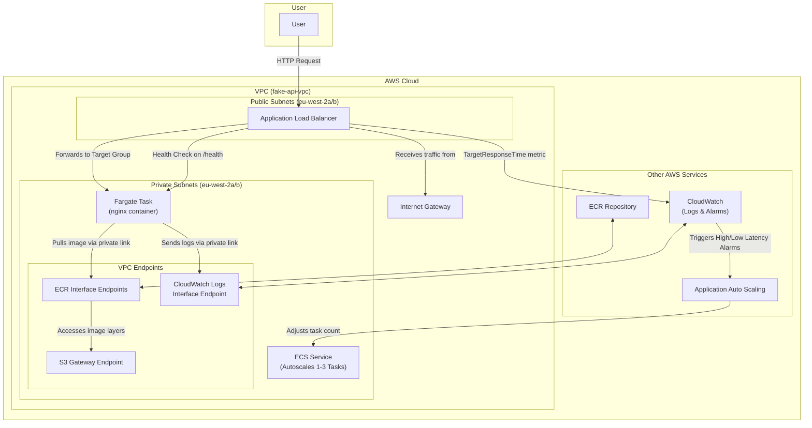

# Docker in AWS Fargate

## AWS config

### ~/.aws/credentials

```ini
[default]
aws_access_key_id = [redacted]
aws_secret_access_key = [redacted]
```

### ~/.aws/config

```ini
[default]
region = eu-west-1

[profile vita-dev]
sso_session = vita-dev
sso_account_id = 050451358653
sso_role_name = Admin
region = eu-west-2

[sso-session vita-dev]
sso_start_url = https://d-9c67018f89.awsapps.com/start/#
sso_region = eu-west-2
sso_registration_scopes = sso:account:access
```

## Tasks

### Build & test image

```sh
docker build -t fake-api . # For local testing

docker stop local-fake-api ; docker rm local-fake-api ; docker run -d --rm -p 9123:9123 -e ELID_DELAY_SECONDS=2 -e APIM_DELAY_SECONDS=10 --name local-fake-api fake-api

curl -v http://localhost:9123/health
curl -v http://localhost:9123/eligibility-signposting-api/patient-check/9658218989
curl -v -X POST http://localhost:9123/oauth2/token

docker build --platform linux/amd64 -t fake-api . # For AWS
```

### Build infra

```sh
aws sso login --profile vita-dev

aws sts get-caller-identity --profile vita-dev

terraform init

AWS_PROFILE="vita-dev" terraform plan

AWS_PROFILE="vita-dev" terraform apply
```

### Upload image

```sh
aws ecr get-login-password --region eu-west-2 --profile vita-dev | docker login --username AWS --password-stdin $(terraform output -raw ecr_repository_url | cut -d/ -f1)

docker tag fake-api:latest $(terraform output -raw ecr_repository_url):latest

docker push $(terraform output -raw ecr_repository_url):latest

aws ecs update-service --cluster fake-api-ecs-cluster --service fake-api-ecs-service --force-new-deployment --profile vita-dev --region eu-west-2

curl -v $(terraform output -raw application_url)/health
curl -v $(terraform output -raw application_url)/eligibility-signposting-api/patient-check/9658218989
curl -v -X POST $(terraform output -raw application_url)/oauth2/token
```

## Load testing

### Install

```sh
brew install vegeta
```

### Run

#### wiremock

```sh
KEYS=("9657933617" "9658218989" "9658220142" "9686368906" "9735548852" "9450114080" "9658218873" "9658218997" "9658220150" "9686368973" "9658218881" "9658219004" "9686369120" "9466447939" "9658218903" "9658219012" "9661033498" "9735548844")

BASE_URL="http://localhost:8081/eligibility-signposting-api/patient-check"
for key in "${KEYS[@]}"; do echo "GET ${BASE_URL}/${key}"; done | vegeta attack -rate=10/s -duration=30s | vegeta report
```

#### nginx

```sh
BASE_URL="http://localhost:9123/eligibility-signposting-api/patient-check"
```

#### nginx on fargate

```sh
BASE_URL="$(terraform output -raw application_url)/eligibility-signposting-api/patient-check"
```

## Misc commands

```sh
docker logs local-fake-api | less +G
docker stats
colima stop && colima start -e
```

### buildx shenannegans

```sh
brew install docker-buildx
colima stop && colima start
docker buildx create --use
docker buildx build --platform linux/amd64 -t fake-api --load .
```

## Architecture


