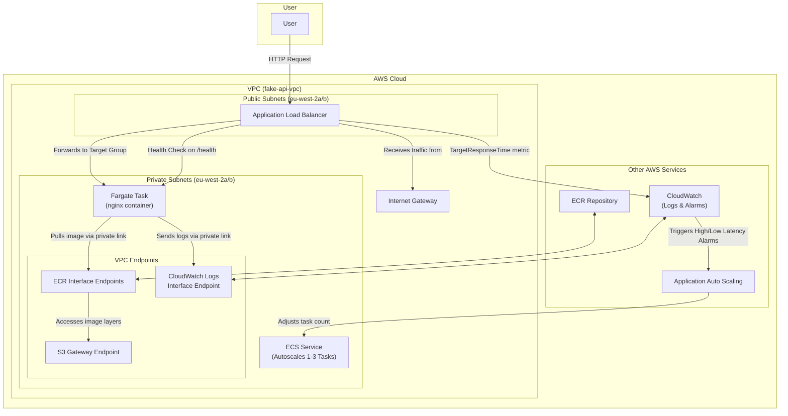

# Fake API for performance testing

## Deploying to Test environment

You'll need to have installed [docker](https://www.docker.com/), the [AWS CLI tools](https://aws.amazon.com/cli/), and [jq](https://jqlang.org/): `brew install docker colima awscli jq` if necessary.

### Deploying infrastructure

Tag, promote, and deploy to the test environment, as per the [usual process](https://nhsd-confluence.digital.nhs.uk/spaces/Vacc/pages/989220238/Branching+and+release+strategy). Wait for the deployment to complete.

### Build & test image

#### Test locally

```sh
docker stop local-fake-api  ## Will fail if the contain doesn't exist, which is fine

./create_tokens.sh "../../../../../../../vita_private_key.pem" "http://localhost:9123" 86400
```

Before you continue, set up buildx for Docker if you haven't done it yet:
```sh
brew install docker-buildx
````
Run the above command and follow the instructions in the output to update ~/.docker/config.json.

```sh
colima stop && colima start
docker buildx version
```

After this, you can build the image and spin up the docker image, and test that it works:
```sh
docker build --no-cache -t fake-api . && docker run -d --rm -p 9123:9123 -e ELID_DELAY_SECONDS=1 -e APIM_DELAY_SECONDS=1 --name local-fake-api fake-api

docker logs local-fake-api --follow | less +F  # If you need to see what's going on in nginx

curl -v http://localhost:9123/health

curl http://localhost:9123/eligibility-signposting-api/patient-check/9658218989 | jq
curl http://localhost:9123/eligibility-signposting-api/patient-check/9658218881 | jq

curl -v -X POST http://localhost:9123/oauth2/token

curl http://localhost:9123/.well-known/openid-configuration | jq
curl -v http://localhost:9123/authorize?state=sausages
curl -X POST http://localhost:9123/token

curl -v http://localhost:9123/nbs?any=old&rubbish=here
```

##### Test against local VitA

In `.env.local` you'll want:

```sh
# For local fake API versions
ELIGIBILITY_API_ENDPOINT=http://localhost:9123/
IS_APIM_AUTH_ENABLED=true
APIM_AUTH_URL=http://localhost:9123/oauth2/token
NHS_LOGIN_URL=http://localhost:9123
NHS_APP_REDIRECT_LOGIN_URL=https://localhost:3000/api/sso?assertedLoginIdentity=sausages
```

Start up VitA as normal, then hit [/api/sso](https://localhost:3000/api/sso?assertedLoginIdentity=sausages).

#### Build image for deployment

For the following steps, you need to have deployed the infrastructure at least once, to get the ALB DNS name.

```sh
aws sso login --profile vita-test

fake_api_url="http://"$(aws elbv2 describe-load-balancers --profile vita-test | jq -r '.LoadBalancers[] | select(.LoadBalancerName == "fake-api-project-alb") | .DNSName')

./create_tokens.sh "../../../../../vita-app-sandpit.pid" "$fake_api_url" 315569520

docker build --no-cache --platform linux/amd64 -t fake-api .
```

### Upload image

Ensure you are [configured to access the test environment in AWS via the command line](https://docs.aws.amazon.com/cli/latest/userguide/getting-started-quickstart.html). These instructions assume you've named your profile `vita-test`. All the info you need for that should be available via the [access portal](https://d-9c67018f89.awsapps.com/start/#/?tab=accounts).

```sh
fake_api_ecr_repository_url=$(aws ecr describe-repositories --profile vita-test | jq -r '.repositories[] | select(.repositoryName == "fake-api") | .repositoryUri')

aws ecr get-login-password --region eu-west-2 --profile vita-test | docker login --username AWS --password-stdin $(echo $fake_api_ecr_repository_url | cut -d/ -f1)

docker tag fake-api:latest "$fake_api_ecr_repository_url":latest

docker push "$fake_api_ecr_repository_url":latest

aws ecs update-service --cluster fake-api-project-cluster --service fake-api --force-new-deployment --profile vita-test --region eu-west-2
```

### Check it's working

Give it a minute, then:

```sh
fake_api_url="http://"$(aws elbv2 describe-load-balancers --profile vita-test | jq -r '.LoadBalancers[] | select(.LoadBalancerName == "fake-api-project-alb") | .DNSName')

curl -v $fake_api_url/health

curl $fake_api_url/eligibility-signposting-api/patient-check/9658218989 | jq
curl $fake_api_url/eligibility-signposting-api/patient-check/9658218881 | jq

curl -v -X POST $fake_api_url/oauth2/token

curl $fake_api_url/.well-known/openid-configuration | jq
curl -v "$fake_api_url/authorize?state=sausages"
curl -X POST $fake_api_url/token

curl -v $fake_api_url/nbs
```

## Local testing

### Build infra

```sh
aws sso login --profile vita-dev

aws sts get-caller-identity --profile vita-dev

terraform init

AWS_PROFILE="vita-dev" terraform plan

AWS_PROFILE="vita-dev" terraform apply
```

### Upload image

```sh
aws ecr get-login-password --region eu-west-2 --profile vita-dev | docker login --username AWS --password-stdin $(terraform output -raw fake_api_ecr_repository_url | cut -d/ -f1)

docker tag fake-api:latest $(terraform output -raw fake_api_ecr_repository_url):latest

docker push $(terraform output -raw fake_api_ecr_repository_url):latest

aws ecs update-service --cluster fake-api-ecs-cluster --service fake-api-ecs-service --force-new-deployment --profile vita-dev --region eu-west-2

curl -v $(terraform output -raw application_url)/health
curl -v $(terraform output -raw application_url)/eligibility-signposting-api/patient-check/9658218989
curl -v -X POST $(terraform output -raw application_url)/oauth2/token
```

## Load testing

### Install

```sh
brew install vegeta
```

### Run

#### wiremock

```sh
KEYS=("9657933617" "9658218989" "9658220142" "9686368906" "9735548852" "9450114080" "9658218873" "9658218997" "9658220150" "9686368973" "9658218881" "9658219004" "9686369120" "9466447939" "9658218903" "9658219012" "9661033498" "9735548844")

BASE_URL="http://localhost:8081/eligibility-signposting-api/patient-check"
for key in "${KEYS[@]}"; do echo "GET ${BASE_URL}/${key}"; done | vegeta attack -rate=10/s -duration=30s | vegeta report
```

#### nginx

```sh
BASE_URL="http://localhost:9123/eligibility-signposting-api/patient-check"
```

#### nginx on fargate

```sh
BASE_URL="$(terraform output -raw application_url)/eligibility-signposting-api/patient-check"
```

## Misc commands

```sh
docker logs local-fake-api | less +G
docker stats
colima stop && colima start -e
```

## Architecture


